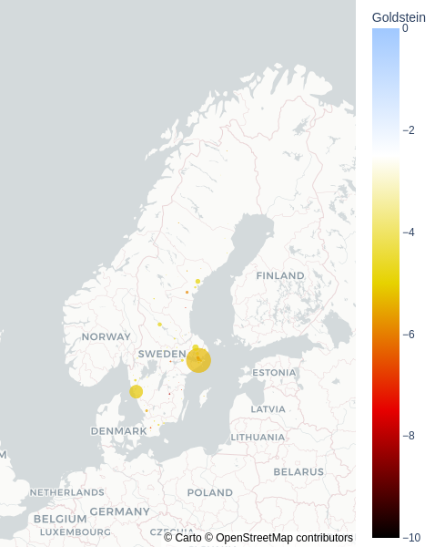

# Spark GDELT Examples
## Detecting Events and Entities of Interest about Trend in OIL Price

Johannes Graner, Albert Nilsson and Raazesh Sainudiin

2020, Uppsala, Sweden

This project was supported by Combient Mix AB through summer internships at:

Combient Competence Centre for Data Engineering Sciences, 
Department of Mathematics, 
Uppsala University, Uppsala, Sweden

See Example notebooks to detect events and persons or entities of interest

- [notebooks/ScaDaMaLe/000b-gdelt-utils](notebooks/ScaDaMaLe/000b_gdelt_utils.md)
- [notebooks/db/gdelt-EOI-detection](notebooks/ScaDaMaLe/030a_gdelt_EOI_detection.md)
- [notebooks/db/gdelt-POI-detection](notebooks/ScaDaMaLe/030b_gdelt_POI_detection.md)

## Investigating events in Swedish media

Yaser Kaddoura, Mohammad Mustakim Ur Rahman, and Raazesh Sainudiin

2021, Uppsala, Sweden

This project was supported by Combient Mix AB through Data Science Project Fellowships between 2021-10 and 2021-12 to Yaser Kaddoura and Mohammad Mustakim Ur Rahman at Combient Competence Centre for Data Engineering Sciences, Department of Mathematics, Uppsala University, Uppsala, Sweden, and databricks University Alliance with infrastructure credits from AWS.

Combient Competence Centre for Data Engineering Sciences, Department of Mathematics, Uppsala University, Uppsala, Sweden

See Example notebooks:

- [notebooks/db/2022_00_GDELT_base](notebooks/db/2022_00_GDELT_base.md)
- [notebooks/db/2022_00a_GDELT_download_CAMEO](notebooks/db/2022_00a_GDELT_download_CAMEO.md) 
- [notebooks/db/2022_00b_GDELT_download_csv](notebooks/db/2022_00b_GDELT_download_csv.md) 
- [notebooks/db/2022_01_GDELT_main](notebooks/db/2022_01_GDELT_main.md)
- [notebooks/db/2022_02a_GDELT_extract_shooting_articles](notebooks/db/2022_02a_GDELT_extract_shooting_articles.md)
- [notebooks/db/2022_02b_GDELT_scraping_Swedish_articles](notebooks/db/2022_02b_GDELT_scraping_Swedish_articles.md)

# Resources

This builds on the following libraries and its antecedents therein:

- [https://github.com/aamend/spark-gdelt](https://github.com/aamend/spark-gdelt)
- [https://github.com/lamastex/spark-trend-calculus](https://github.com/lamastex/spark-trend-calculus)

## This work was inspired by:

- Antoine Aamennd's [texata-2017](https://github.com/aamend/texata-r2-2017)
- Andrew Morgan's [Trend Calculus Library](https://github.com/ByteSumoLtd/TrendCalculus-lua)

---
---

[edit on GitHub](https://github.com/lamastex/spark-gdelt-examples/edit/master/README.md)
